# CodeWatch

**Local AI code review — watches your files, streams reviews in real time. Your code never leaves your machine.**




## What it does

CodeWatch watches a project folder for file changes, automatically sends changed files to a local LLM running via [Ollama](https://ollama.com), and streams the code review results to a web dashboard in real time. Everything runs locally — no cloud, no telemetry, your code stays on your machine.

## Features

- **Live file watching** — detects saves instantly, debounces rapid edits
- **Streaming reviews** — tokens appear in the UI as they're generated
- **Works with any Ollama model** — `qwen2.5-coder`, `codellama`, `llama3.2`, or anything you've pulled
- **Diff-aware** — subsequent reviews focus on what changed, not the whole file
- **.gitignore-aware** — respects your project's ignore rules automatically
- **Desktop notifications** — critical and warning alerts via your OS notification system
- **Optional Telegram notifications** — get alerts on your phone
- **Dark UI** — three-column layout: projects | feed | detail
- **Local only** — no internet required after setup

---

## Requirements

- Python 3.10+
- Node.js 18+ and npm
- [Ollama](https://ollama.com) installed and running locally, with at least one model pulled

Pull a model before starting CodeWatch:
```bash
ollama pull qwen2.5-coder:3b   # fast, good for code
ollama pull codellama           # alternative
ollama pull llama3.2            # general purpose
```

CodeWatch works with any model — you choose what to use.

---

## Quick start (step-by-step)

You'll need **three terminals open at once**: one for Ollama, one for the backend, one for the frontend (dev only). In production you only need Ollama + backend.

### Step 1 — Clone the repo

```bash
git clone https://github.com/kazirafi09/Code-Watch.git
cd codewatch
```

### Step 2 — Pull a model with Ollama

CodeWatch needs a model that's actually capable of parsing code. **Small models (≤4B) produce unreliable reviews.** Recommended:

```bash
ollama pull qwen2.5-coder:7b     # best balance for most machines
# or
ollama pull gemma2:9b             # larger, stronger reasoning
```

Keep Ollama running in its own terminal (or use the desktop app):

```bash
# Terminal 1 — Ollama
ollama serve
```

### Step 3 — Install dependencies

**Unix / macOS:**
```bash
./install.sh
```

**Windows:**
```bat
install.bat
```

This creates a Python virtualenv, installs backend requirements, runs `npm install` in `frontend/`, and builds the frontend bundle.

### Step 4 — Start the backend

```bash
# Terminal 2 — Backend
# Unix / macOS:
source .venv/bin/activate
uvicorn backend.main:app --reload --port 8000

# Windows:
.venv\Scripts\activate
uvicorn backend.main:app --reload --port 8000
```

**Keep this terminal visible** — its logs are how you diagnose problems. You should see:

```
[INFO] backend.services.watcher: File watcher started
[INFO] backend.main: CodeWatch is ready. Open http://localhost:8000
```

### Step 5 — (Optional) Start the frontend dev server

Only needed if you're hacking on the UI. The backend already serves the built frontend at `http://localhost:8000`.

```bash
# Terminal 3 — Frontend (optional)
cd frontend
npm run dev      # http://localhost:5173, proxies to backend
```

### Step 6 — Pick your model

1. Open **http://localhost:8000** in a browser.
2. Click the **gear** icon to open Settings.
3. CodeWatch queries Ollama and lists every model you've pulled in the **Model** dropdown. Pick one and click **Save**.

This writes `config.yaml` for you — no manual editing required. You can switch models here at any time; changes hot-reload.

### Step 7 — Add your first project

1. Open **http://localhost:8000** in a browser.
2. Click the **+** button in the sidebar.
3. Enter a name and the **absolute path** to a project folder you want reviewed (e.g. `D:\Projects\my-app` or `/home/you/projects/my-app`).
4. Save. The backend log should print `Watching project '<name>' at <path>`.

### Step 8 — Trigger your first review


Edit any file with a watched extension (`.py`, `.js`, `.ts`, etc.) in that project and save. Within a second or two you should see:

- In the backend terminal: `Queued review: <path>`
- In the UI: a new card appears in the feed and tokens stream in as the model generates

If nothing happens, jump to the **Troubleshooting** section below.

---

## Using CodeWatch

1. **Add a project** — click **+** in the sidebar, enter a name and the full path to your project folder
2. **Edit any file** in that folder — CodeWatch detects the change and queues a review
3. **Watch the review stream** — tokens appear in the feed as the model generates them
4. **Click a review** — the detail panel shows the full review with copy/export/delete options
5. **Manual trigger** — click "Review" next to any file in the file tree, or use the API

Severity is auto-detected from the review text:
- **Critical** (red) — security issues, vulnerabilities
- **Warning** (amber) — bugs, unsafe patterns
- **Suggestion** (blue) — improvements, style

---

## Configuration reference

Most settings are edited in the in-app **Settings** page and take effect immediately — no restart, no YAML hand-editing. `config.yaml` is written by the app; you only need to touch it if you want to pre-seed defaults before first launch (copy `config.example.yaml` → `config.yaml`).

| Key | Type | Default | Description |
|-----|------|---------|-------------|
| `model` | string | `""` | **Required.** Pick from the Settings dropdown (populated from `ollama list`). |
| `ollama_url` | string | `http://localhost:11434` | Ollama API base URL |
| `ollama_timeout_seconds` | int | `120` | Per-request timeout |
| `watch_extensions` | list | `.py .js .ts ...` | File extensions to watch |
| `ignore_patterns` | list | `node_modules .git ...` | Path fragments to skip |
| `respect_gitignore` | bool | `true` | Honour `.gitignore` in project root |
| `debounce_seconds` | float | `1.5` | Wait this long after last change before triggering |
| `max_file_lines` | int | `400` | Skip files longer than this |
| `skip_unchanged` | bool | `true` | Skip re-review if file content hasn't changed |
| `review_mode` | string | `auto` | `auto` / `always_full` / `always_diff` |
| `max_concurrency` | int | `1` | Parallel reviews (1 is best for local LLMs) |
| `prompt_max_chars` | int | `16000` | Truncate prompts beyond this length |
| `notifications.desktop` | bool | `true` | Enable desktop notifications |
| `notifications.desktop_severities` | list | `[critical, warning]` | Which severities trigger desktop alerts |
| `notifications.telegram` | bool | `false` | Enable Telegram notifications |
| `notifications.telegram_severities` | list | `[critical]` | Which severities go to Telegram |
| `log_level` | string | `INFO` | `DEBUG` / `INFO` / `WARNING` / `ERROR` |

### Secrets (Telegram token, chat ID)

Store these in `.env`, not `config.yaml`:
```
TELEGRAM_TOKEN=your_bot_token
TELEGRAM_CHAT_ID=your_chat_id
```

---

## Changing the model

Open **Settings** in the UI, pick from the model dropdown (populated from your local Ollama via `/api/tags`), click **Save**. CodeWatch hot-reloads — no restart needed. Pull a new model with `ollama pull <name>` and it appears in the dropdown on the next open.

---

## Notifications

**Desktop:** enabled by default via `plyer`. Works on Windows, macOS, and most Linux desktops.

**Telegram:**
1. Create a bot via [@BotFather](https://t.me/BotFather) — copy the token
2. Get your chat ID (send a message to the bot, then check `https://api.telegram.org/bot<TOKEN>/getUpdates`)
3. Add to `.env`:
   ```
   TELEGRAM_TOKEN=your_token_here
   TELEGRAM_CHAT_ID=your_chat_id_here
   ```
4. Enable in Settings → Notifications → Telegram

---

## Troubleshooting

> **Golden rule:** when anything goes wrong, **look at the backend terminal first.** Almost every problem logs a clear message there. The UI alone will not tell you what's wrong.

### Reviews never start when I save a file

Work through these in order:

**1. Is the project registered with the watcher?**
On backend startup you should see a line like `Watching project '<name>' at <path>`. If not, open the UI and click **+** to add the project. The path must be absolute and must exist.

**2. Did the backend crash on reload?**
`uvicorn --reload` restarts on every file save. If your edit introduced a `SyntaxError` or `ImportError` *anywhere in the codebase*, the backend silently crashes — the UI stays loaded but nothing works. Scroll the backend terminal for a traceback. Common culprits: a stray character left in a Python file, a comment without `#`, an import that doesn't exist.

**3. Is the reviewer crashing when a review runs?**
Even with the watcher healthy, the reviewer imports project modules each time. If `backend/utils/language.py` or another module has a SyntaxError, *every* review fails with `SyntaxError: invalid syntax` in the queue worker log, and no output reaches the UI. Fix the broken file.

**4. Are watchdog events firing at all?**
Temporarily add this to `backend/services/watcher.py` inside `ProjectHandler.on_modified`:
```python
logger.info("watchdog: %s", event.src_path)
```
Save a file in the watched project. If nothing logs, watchdog isn't seeing OS events — possible causes: antivirus interception, files on a network drive, or an editor that uses atomic-rename saves (add an `on_moved` handler for that).

**5. Is the file being filtered out?**
A save can reach the watcher but get rejected by these gates (in order):
- Extension not in `watch_extensions`
- Path contains any string in `ignore_patterns`
- `respect_gitignore: true` and the file is `.gitignore`'d
- File is binary (null bytes in first 8KB)
- File exceeds `max_file_lines` (default 400)
- `skip_unchanged: true` and content hash is identical to the last review

Set `log_level` to `DEBUG` in Settings to see `Skipping …` messages with the reason.

### Reviews are useless / hallucinate issues / every review is marked critical

**Your model is too small.** Models in the 3–4B range frequently invent issues, miss real bugs, and echo severity words from the prompt. Pull a 7B+ code-tuned model (`qwen2.5-coder:7b`, `deepseek-coder-v2`) and select it in Settings.

If severity still looks wrong after that, the model is probably not emitting the expected `### [critical|warning|suggestion]` header format — the severity detector in `reviewer.py` falls back to keyword matching, which can misfire if the model quotes rule text verbatim.

### Ollama connection refused (port 11434)

```bash
curl http://localhost:11434/api/tags
```
If this fails, Ollama isn't running or a firewall is blocking it. Start it with `ollama serve` or launch the desktop app.

### Port 8000 already in use

```bash
uvicorn backend.main:app --reload --port 8001
```
Then open `http://localhost:8001` instead.

### Reviews feel extremely slow

- Use a smaller quantisation (e.g. `:7b-instruct-q4_K_M`)
- Increase `debounce_seconds` so rapid saves don't queue multiple reviews
- Lower `prompt_max_chars` to send less context
- Set `review_mode: always_diff` after the first review of a file

### I broke it — how do I start over?

```bash
rm codewatch.db         # wipes all projects and review history
# restart backend
```
Configuration stays in `config.yaml`; only the SQLite DB is reset.

---

## CLI (pre-commit / CI)

CodeWatch ships a `codewatch` console script that runs a one-shot review against a local Ollama and exits non-zero when issues are found. It does **not** require the FastAPI server to be running — it reads `config.yaml` from the current directory for `model` and `ollama_url`.

```bash
pip install -e .    # from the repo root, once
codewatch review path/to/file.py --fail-on critical
```

Exit codes: `0` clean / `1` review completed but severity ≥ `--fail-on` found / `2` reviewer could not run (Ollama down, file missing, no model configured).

### pre-commit hook

Add to `.pre-commit-config.yaml`:

```yaml
- repo: local
  hooks:
    - id: codewatch
      name: CodeWatch review
      entry: codewatch review --fail-on critical
      language: system
      files: '\.(py|js|jsx|ts|tsx|go|rs|java|rb|cpp|c|h|cs|kt|swift|php)$'
```

### GitHub Action

The repo exposes a composite action via `action.yml`:

```yaml
- uses: kazirafi09/Code-Watch@main
  with:
    model: qwen2.5-coder:7b
    fail-on: critical
```

The action runs `codewatch review` over every changed file in the PR (or an explicit `paths:` input) and fails the job if a critical issue is reported. You'll need Ollama reachable from the runner — the simplest path is a self-hosted runner with `ollama serve` running locally.

---

## Hardening (optional)

- **Bind to loopback only.** `start.sh` / `start.bat` pass `--host 127.0.0.1` by default. If you change that flag, set `CODEWATCH_REQUIRE_TOKEN=1` before `uvicorn` so every `/api/*` request and the `/ws` connection requires a bearer token. The token is written to `~/.codewatch/token` on first boot and printed in the log with a ready-to-use `http://localhost:8000/?token=<value>` URL.
- **SSRF guard on `ollama_url`.** The backend rejects any `ollama_url` whose host doesn't resolve to loopback/RFC1918/link-local. Set `CODEWATCH_ALLOW_REMOTE_OLLAMA=1` only if you intentionally point at a remote Ollama.
- **Liveness/readiness.** `GET /livez` (always 200) and `GET /healthz` (200/503 with per-dep checks) are public so Docker/k8s/uptime probes can reach them without credentials.

---

## Docker

```bash
docker compose up --build
```

Then open `http://localhost:8000`, go to Settings, and pick a model from the dropdown.

Ollama must be running on the host. The container reaches it via `host.docker.internal:11434`.

---

## Contributing

PRs and issues welcome. Please open an issue before working on large changes.

---

## License

MIT — see [LICENSE](LICENSE).

---

## Acknowledgements

[Ollama](https://ollama.com) · [FastAPI](https://fastapi.tiangolo.com) · [React](https://react.dev) · [Vite](https://vitejs.dev) · [Tailwind CSS](https://tailwindcss.com) · [watchdog](https://github.com/gorakhargosh/watchdog)
